

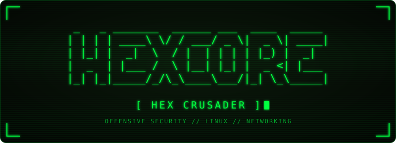

 

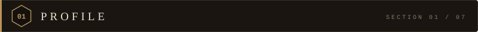

> **Red Teaming · Penetration Testing**

Building a strong foundation in **Linux, networking, programming, and offensive security**, with a focus on **penetration testing and red teaming**, and a growing interest in **exploit development, malware analysis, and cryptography**.

 

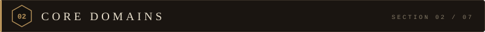

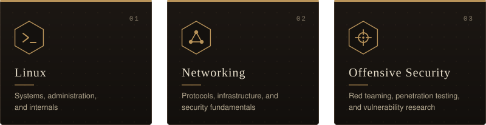

 

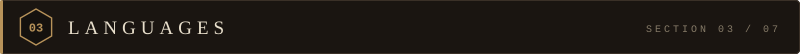

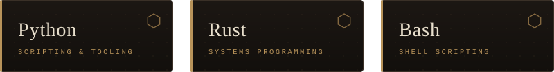

 

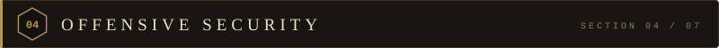

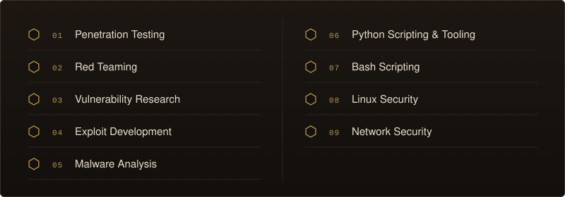

 

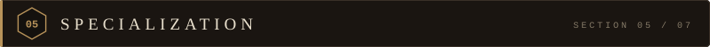

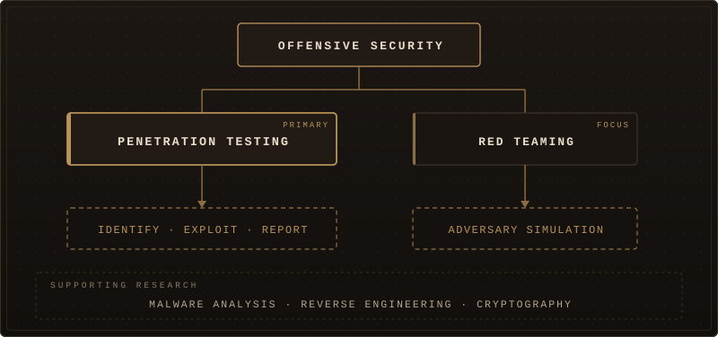

**Primary focus:** penetration testing, complemented by red teaming.
**Supporting research:** malware analysis, reverse engineering, and cryptography.

 

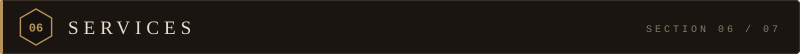

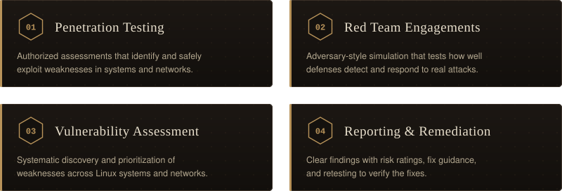

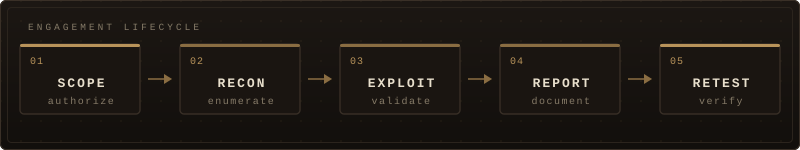

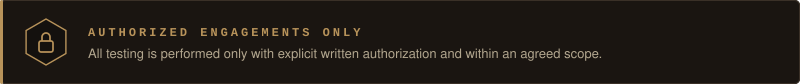

To discuss an engagement, reach out through the contact links on this profile.

 

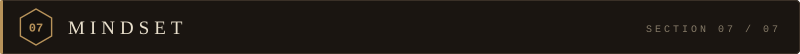

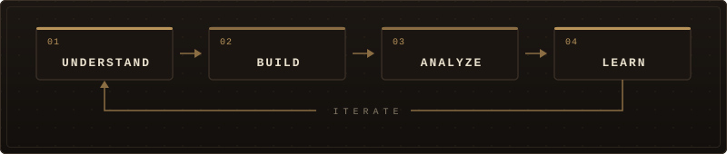

 

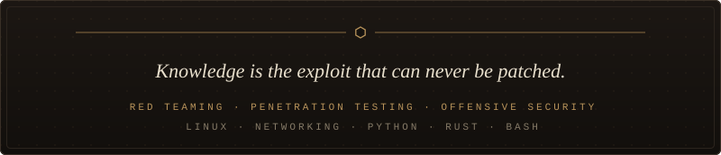
